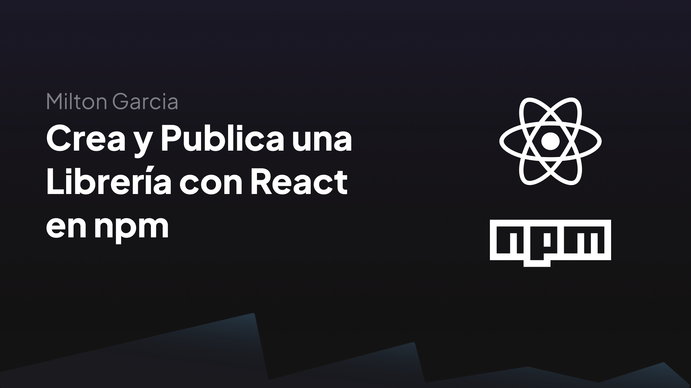
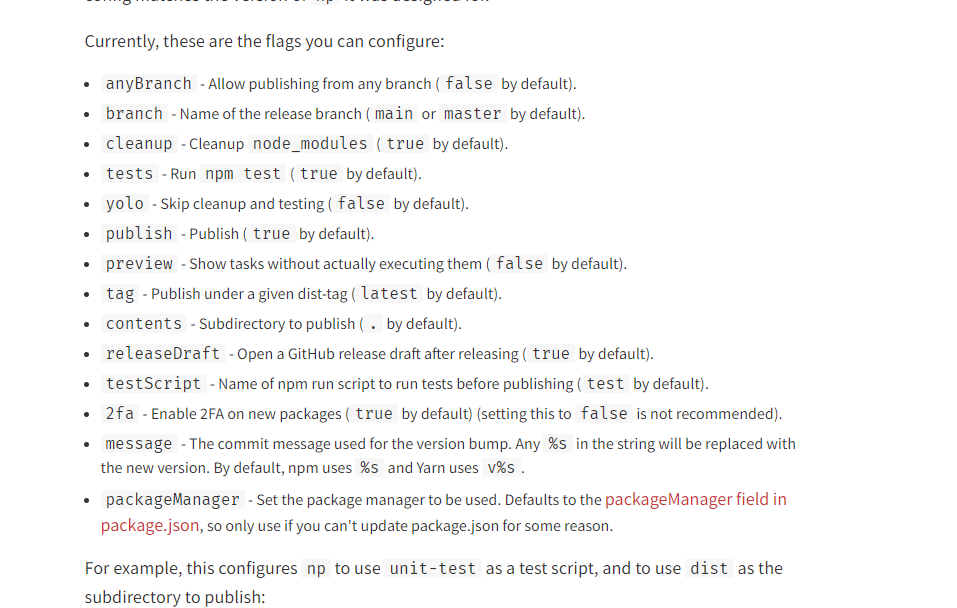
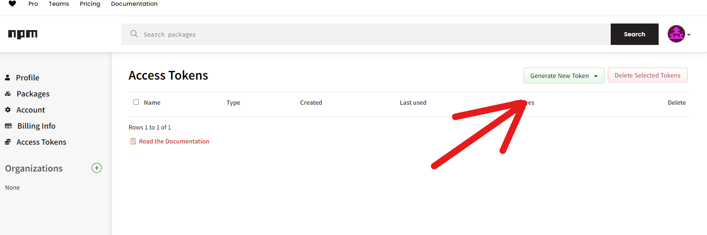
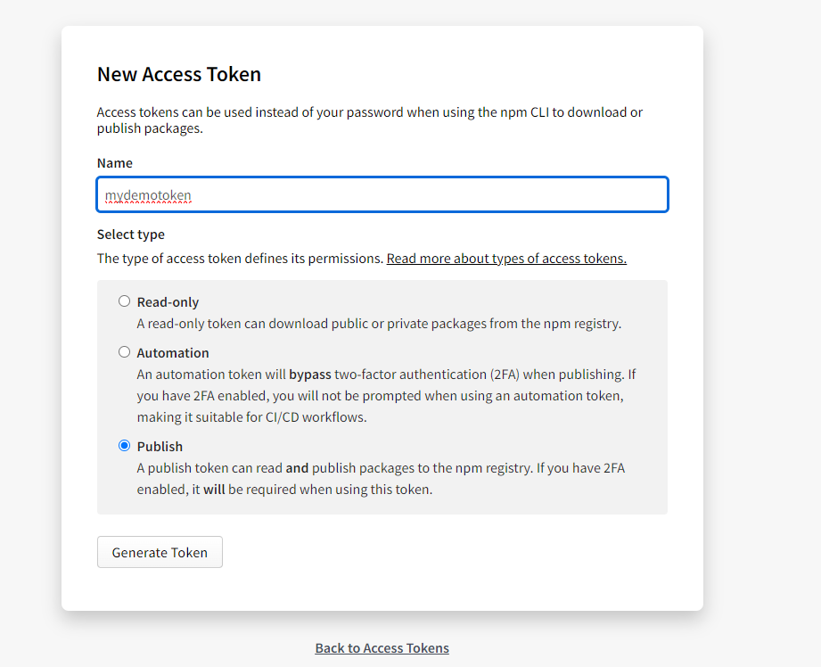
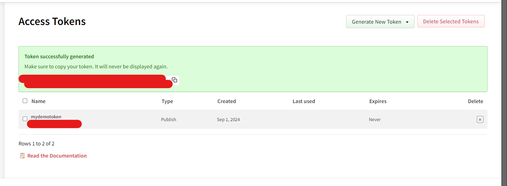
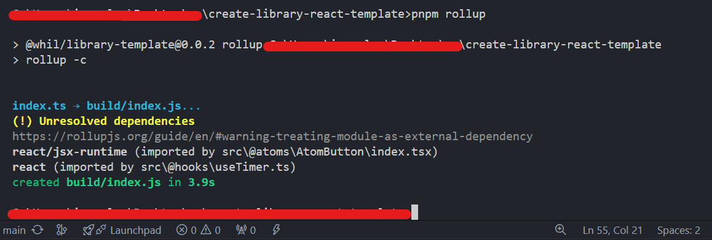
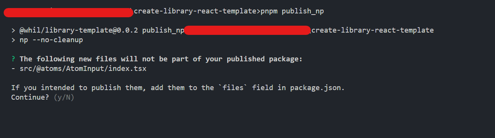
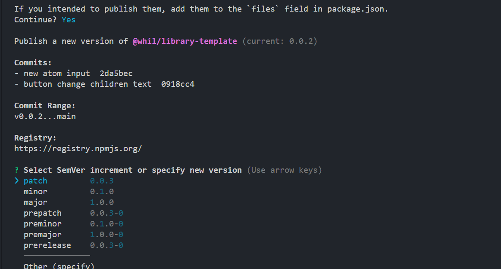
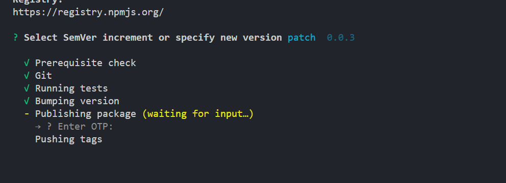
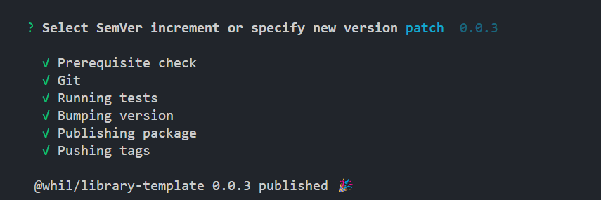

# Crea y Publica una Librería con React en npm

Este articulo te explicara todo acerca de la instalacion, configuracion y publicacion de una libreria con react y typescript. Voy a usar el empaquetador Rollup con typescript. Espero y te sirva!

## Instalacion

En este caso usare Nextjs v13. Pero puedes utilizar vite o astro, Solamente lo usaremos para desarrollar nuestros componentes, hooks, utils... etc.

Enlace: https://nextjs.org/docs/getting-started/installation

## npx create-next-app@latest

```javascript
What is your project named? my-app
Would you like to use TypeScript? Yes
Would you like to use ESLint? Yes
Would you like to use Tailwind CSS? No
Would you like your code inside a `src/` directory? Yes
Would you like to use App Router? (recommended) No
Would you like to use Turbopack for `next dev`? No
Would you like to customize the import alias (`@/*` by default)? Yes
What import alias would you like configured? @/\*
```

Luego debes instalar este paquete de forma global en tu computadora. NP es un paquete que permite automatizar todo el proceso de publicacion de una libreria. Por Ejemplo reinstala las dependencias, Ejecuta los tests, Aumenta la version del package.json , crea una etiqueta de la version en git y publica la version en npm.

Enlace: https://www.npmjs.com/package/np

```javascript
npm install --global np
```

luego debes instalar las siguientes librerias como devDependencies.

```json
{
  /// rest config
  "dependencies": {
    "eslint": "8.30.0",
    "next": "13.1.1",
    "react": "18.2.0",
    "react-dom": "18.2.0",
    "tslib": "^2.5.3",
    "typescript": "4.9.4"
  },
  "devDependencies": {
    "@rollup/plugin-alias": "^5.0.0",
    "@rollup/plugin-commonjs": "^24.0.1",
    "@rollup/plugin-inject": "^5.0.3",
    "@rollup/plugin-json": "^6.0.0",
    "@rollup/plugin-node-resolve": "^15.0.2",
    "@rollup/plugin-typescript": "^11.1.0",
    "@types/node": "18.11.18",
    "@types/react": "18.0.26",
    "@types/react-dom": "18.0.10",
    "global": "^4.4.0",
    "rollup": "2.68.0",
    "rollup-plugin-alias": "^2.2.0",
    "rollup-plugin-multi-entry": "^2.1.0",
    "rollup-plugin-node-polyfills": "^0.2.1",
    "rollup-plugin-peer-deps-external": "^2.2.4",
    "rollup-plugin-polyfill-node": "^0.8.0",
    "rollup-plugin-typescript2": "0.34.1"
  }
}
```

@rollup/plugin-alias: Este plugin permite crear alias para rutas en tu proyecto, lo que facilita las importaciones. Por ejemplo, en lugar de escribir rutas largas o complejas, puedes definir alias como @components para referirte a una carpeta de componentes.

@rollup/plugin-commonjs: Permite que Rollup convierta módulos CommonJS (el sistema de módulos utilizado en Node.js) a ESModules (el estándar moderno para módulos en JavaScript). Esto es útil cuando trabajas con dependencias que están escritas en formato CommonJS.

@rollup/plugin-inject: Este plugin permite inyectar variables globales automáticamente en los módulos donde se necesitan. Por ejemplo, si un módulo necesita process o Buffer, este plugin puede inyectar esas variables sin necesidad de importarlas explícitamente en cada archivo.

@rollup/plugin-json: Permite a Rollup importar archivos JSON como si fueran módulos. Esto es útil cuando quieres manejar datos JSON directamente en tu código sin tener que hacer peticiones para obtenerlos.

@rollup/plugin-node-resolve: Este plugin permite que Rollup resuelva módulos desde node_modules. Esto es esencial cuando estás trabajando con dependencias externas que están instaladas en node_modules.

@rollup/plugin-typescript: Añade soporte para TypeScript en Rollup, permitiendo que compile archivos .ts y .tsx como parte de tu proceso de build.

global: Esta librería define un objeto global para entornos que no lo tienen, lo que puede ser necesario cuando estás trabajando en un entorno que no es Node.js y necesitas un objeto global similar.

rollup: Es el empaquetador principal para crear el bundle del proyecto. Rollup toma tus módulos y los combina en un solo archivo, optimizando el código en el proceso.

El resto de librerias son complementos de las librerias principales, esto sirve al momento de hacer un build.

## Configuracion

1. package.json
   Tienes que configurar los siguientes campos, esto permitira indicarle a npm que carpeta con que archivos y el nombre que llevara la libreria, los comandos.

```json
{
  "engines": {
    "node": ">=20"
  },
  "files": ["build"],
  "license": "UNLICENSED",
  "main": "build/index.js",
  "name": "@whil/library-template",
  "description": "A template for creating libraries with react by @ivanglpz",
  "peerDependencies": {},
  "publishConfig": {
    "access": "public",
    "registry": "https://registry.npmjs.org/"
  },
  "scripts": {
    "rollup": "rollup -c",
    "dev": "next dev",
    "lint": "next lint",
    "start": "next start -p 3001",
    "test": "rollup -c",
    "build": "next build",
    "publish_np": "np --no-cleanup"
  },
  "types": "./build\\index.d.ts",
  "version": "0.0.0"
  //rest config
}
```

El campo name es el nombre que aparecera en npm luego de subirlo, Pero tienes que colocar el nombre de la cuenta que esta publicando seguido del nombre del paquete @mynamenpm/module

Los scripts importantes son:

Rollup: Crea el codigo final que se enviara a npm.

publish_np: Permite ejecutar np listo para publicar a npm.

test: Np necesita un script para saber si el codigo funciona, en este caso le puse el mismo script de rollup -c

2. rollup.config.js
   Al ejecutar el script test o rollup necesitas este archivo de configuracion en la carpeta raiz de tu proyecto, afuera de src.

```javascript
rollup.config.js;

import commonjs from "@rollup/plugin-commonjs";
import json from "@rollup/plugin-json";
import alias from "rollup-plugin-alias";
import peerDepsExternal from "rollup-plugin-peer-deps-external";
import typescript from "rollup-plugin-typescript2";

const config = [
  {
    input: "index.ts",
    output: [
      {
        file: "build/index.js",
        format: "cjs",
        sourcemap: true,
      },
    ],
    plugins: [
      json(),
      peerDepsExternal(),
      alias({
        applicationRoot: `${__dirname}`,
      }),
      commonjs(),
      typescript({
        useTsconfigDeclarationDir: true,
        tsconfig: "tsconfig-rollup.json",
      }),
    ],
  },
];

export default config;
```

Este script lo que dice, es que rollup tomara como punto de entrada index.ts, y el punto de salida sera en build. Y los plugins permiten expotar los types, json, los alias y dependencias externas que utilicemos en nuestros modulos y estaran disponibles en el paquete final.

tsconfig-rollup.json
Crea un archivo json y nombralo "tsconfig-rollup.json". Este json, toma la configuracion de tsconfig y la extiende con opciones de jsx, en este caso para react.

```json
{
  "compilerOptions": {
    "jsx": "react-jsx"
  },
  "extends": "./tsconfig.json"
}
```

2. tsconfig.json
   esta configuracion de typescript permite indicar cual es lugar donde nuestros types se guardan luego del build de rollup. en este caso en el mismo "build".

```json
{
  "compilerOptions": {
    "allowJs": true,
    "allowSyntheticDefaultImports": true,
    "declaration": true,
    "declarationDir": "build",
    "downlevelIteration": true,
    "esModuleInterop": true,
    "forceConsistentCasingInFileNames": true,
    "incremental": true,
    "isolatedModules": true,
    "jsx": "preserve",
    "lib": ["dom", "dom.iterable", "esnext", "es6", "es2016", "es2017"],
    "module": "esnext",
    "moduleResolution": "node",
    "noEmit": true,
    "paths": {
      "@/_": ["./src/_"]
    },
    "resolveJsonModule": true,
    "skipLibCheck": true,
    "sourceMap": true,
    "strict": true,
    "target": "ESNext"
  },
  "exclude": ["node_modules", "build"],
  "include": ["**/*", "**/*x", "**/*.d.ts"]
}
```

3. .np-config.js
   Este archivo unicamente indica de que forma se ejecutaran las reinstalaciones, los test.

```javascript
module.exports = {
  yarn: false,
  test: false,
  "2fa": false,
  cleanup: false,
  npm: false,
};
```

Estos son todas las propiedades que puede utilizar np. Revisa cual se adapta mejor a tus requisitos.



## Creacion del modulo.

Crea un archivo index.ts, este sera el punto de entrada de rollup para compilar el modulo.

```javascript
index.ts;

export * from "./src/@atoms";
export * from "./src/@hooks";
```

Para este ejemplo voy a usar atomic design y voy a crear un boton y un hook. usare el barrel pattern de typescript. lo que permite es que en el futuro si agrego mas componentes o hooks puedo simplemente agregarlo al archivo de @hooks o @atoms.

```javascript
root/
│
├── @atoms/
│   └── AtomButton/
│       └── index.tsx
│   ├── index.ts
├── @hooks/
│   ├── index.ts
│   └── useTimer.ts
│
└── pages/
```

Y este sera mi componente, un simple button con hello world

```javascript
export const AtomButton = () => {
  return <button>hello world</button>;
};
```

y lo importo en @atoms => index.ts

```javascript
export { AtomButton } from "./AtomButton";
```

y mi hook sera un useDebounce

```javascript
import { useEffect, useState } from "react";

type Props = {
  callback: () => void,
  ms?: number,
  end?: number,
};

export const useDebounce = (props: Props) => {
  const { callback, ms, end } = props;
  const [timer, setTimer] = useState(3);

  const [load, setLoad] = useState(true);
  useEffect(() => {
    const intervalTimer = setInterval(() => {
      if (timer === (end ?? 3)) {
        if (!load) {
          callback?.();
        }
        setLoad(true);
        clearTimeout(intervalTimer);
      } else {
        setLoad(false);
        setTimer((prev) => prev + 1);
      }
    }, ms ?? 1000);

    return () => clearInterval(intervalTimer);
  }, [timer]);

  return {
    timer,
    ms,
    end,
    setTimer,
    load,
    setLoad,
  };
};
```

y lo importo en @hooks => index.ts

```javascript
export { useTimer } from "./useTimer";
```

## Publicar en npm

Dirigete a la pagina de npm, en la seccion de access tokens https://www.npmjs.com/settings/test/tokens y debes crear un nuevo token de tipo classic token.



Este nuevo token debe ser de tipo publish. para que pueda publicar paquetes. tambien te pedira 2FA activado.



Luego este token nuevo debes copiarlo y crearas un archivo .npmrc



Este archivo .npmrc debe estar en la carpeta principal. en este caso en windows es en

C:\Users\yourusername/.npmrc

```json
registry=https://registry.npmjs.org/
//registry.npmjs.org/:_authToken=TU TOKEN DE NPM SIN COMILLAS TODO JUNTO
```

este archivo lo usara np para hacer la publicacion del paquete.

### 2. Compilar

Tienes que ejecutar el script rollup y debe mostrarte un mensaje como este. Debes tener todos tus cambios subidos a tu repositorio.


Ahora ejecuta el script publish_np. este script al princpio preguntara si todos los archivos que te enlistara seran incluidos. Aceptas que si. y



Luego de indicara que tipo de version es, puede ser patch, minor, major, prepatch. En mi caso es un patch. Si no conoces que tipo de version debes utilizar te recomiendo leer este documento que lo explica mas a detalle. https://semver.org/#semantic-versioning-specification-semver



Aqui debes colocar el codigo de autenticacion 2FA que posee tu cuenta. esto es requerido por parte de npm



Y listo. El paquete ya se encuentra en npm y puedes utilizarlo en cualquier proyecto.


